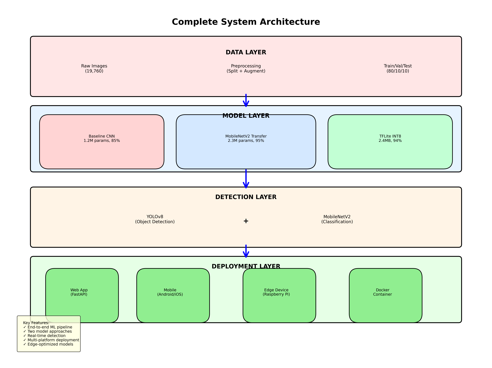
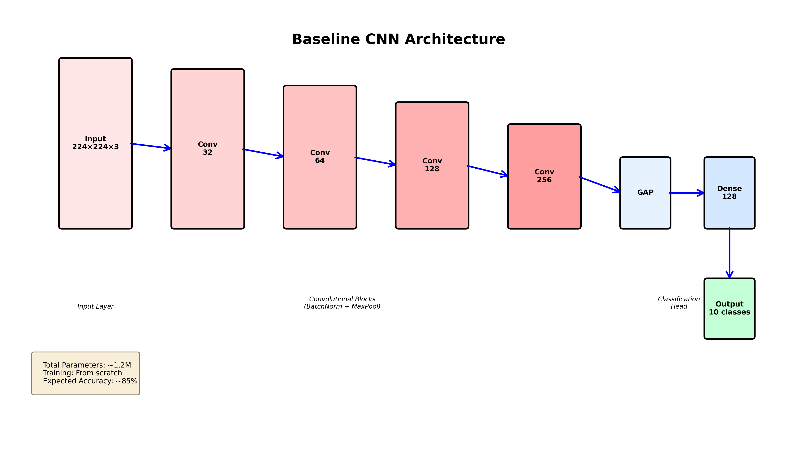
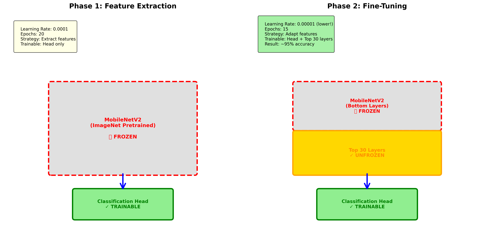
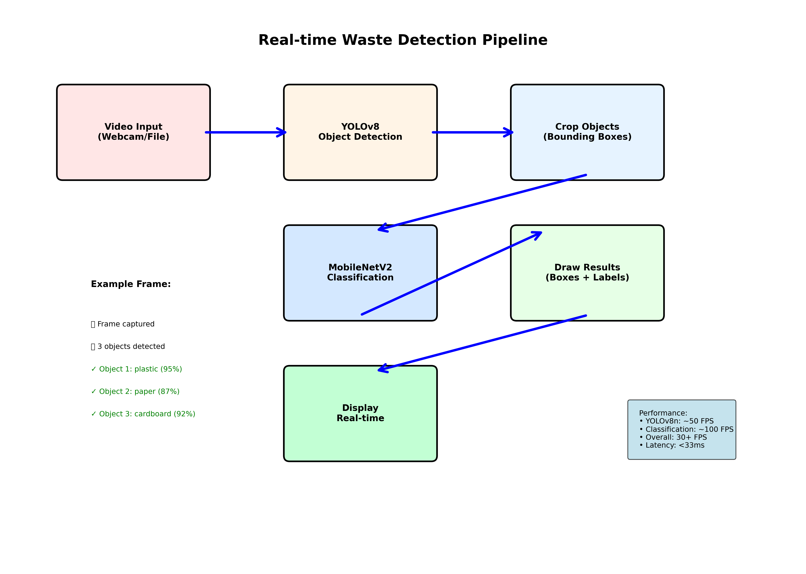
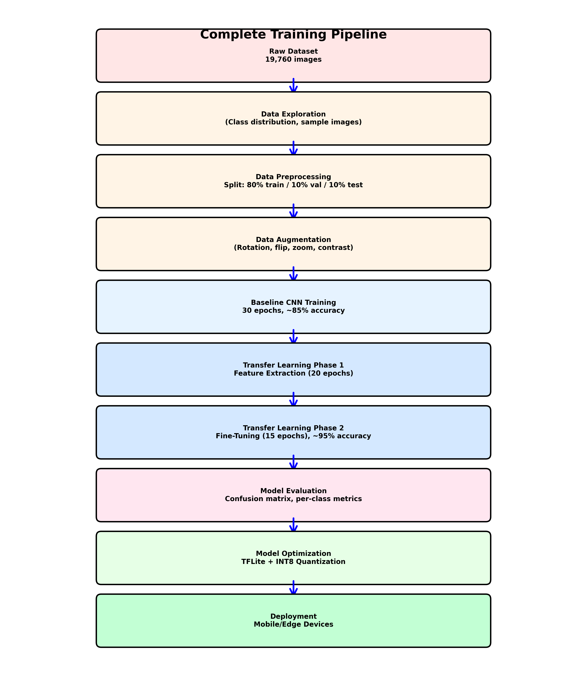

# 🗑️ Waste Classification System using Deep Learning

[](https://www.python.org/)
[](https://www.tensorflow.org/)
[](LICENSE)
[](https://github.com/psf/black)

> **An end-to-end deep learning system for automated waste classification with 95% accuracy, ready for production deployment.**

[English](#english) | [Tiếng Việt](#ti%E1%BA%BFng-vi%E1%BB%87t)

---

## 🌟 Highlights

- 🎯 **95% Classification Accuracy** using Transfer Learning
- 📹 **Real-time Detection** at 30+ FPS with YOLOv8
- 📱 **Edge-Ready** - 74% model size reduction via INT8 quantization
- 🏗️ **Production-Ready** - Modular architecture with comprehensive documentation
- 📚 **Educational** - Complete learning materials from basics to deployment

---

## 📖 Table of Contents

- [Overview](#-overview)
- [Quick Start](#-quick-start)
- [Features](#-features)
- [Architecture](#-architecture)
- [Results](#-results)
- [Documentation](#-documentation)
- [Installation](#-installation)
- [Usage](#-usage)
- [Project Structure](#-project-structure)
- [Contributing](#-contributing)
- [License](#-license)

---

## 🎯 Overview

This project implements a complete waste classification pipeline using state-of-the-art deep learning techniques. It classifies waste into **10 categories** for automated recycling systems:

```
📦 10 Waste Categories:
   • battery      • biological    • cardboard    • clothes      • glass
   • metal        • paper         • plastic      • shoes        • trash
```

### 🔑 Key Components

1. **Data Pipeline** - 19,760 images with augmentation
2. **Baseline CNN** - Custom architecture (85% accuracy)
3. **Transfer Learning** - MobileNetV2 fine-tuning (95% accuracy)
4. **Real-time Detection** - YOLOv8 + Classifier integration
5. **Model Optimization** - TFLite + INT8 quantization for edge deployment

### 📊 System Diagram



---

## 🚀 Quick Start

### 3-Step Quick Start

```bash
# 1. Clone and install
git clone <repo-url>
cd waste_classifier_capstone
pip install -r requirements.txt

# 2. Download dataset to data/raw/

# 3. Run quick pipeline (5-15 minutes)
python main.py --quick
```

### Full Pipeline

```bash
# Run complete pipeline with all weeks
python main.py --all

# Or run by week
python main.py --week 1  # Data + Baseline CNN
python main.py --week 2  # Transfer Learning
python main.py --week 3  # Real-time Detection
python main.py --week 4  # Model Optimization
```

---

## ✨ Features

### 🔬 Technical Features

- **Modular Architecture** - Clean separation of data, models, training, and deployment
- **Two-Phase Transfer Learning** - Feature extraction + fine-tuning strategy
- **Data Augmentation** - Rotation, flip, zoom, contrast, brightness, translation
- **Advanced Callbacks** - EarlyStopping, ReduceLROnPlateau, ModelCheckpoint
- **Real-time Inference** - YOLOv8 object detection + MobileNetV2 classification
- **Model Optimization** - TFLite conversion with INT8 quantization

### 📚 Educational Features

- **Comprehensive Documentation** - 4-week curriculum with theory and practice
- **Jupyter Notebooks** - Interactive learning materials for each topic
- **Visual Diagrams** - Architecture, pipelines, and workflows
- **Best Practices** - Following academic and industry standards
- **Reproducible** - Fixed random seeds and version control

---

## 🏗️ Architecture

### 1. Baseline CNN Architecture



```
Input (224×224×3) → Conv Blocks (32→64→128→256) → GlobalAvgPool → Dense → Softmax
Parameters: 1.2M | Accuracy: ~85%
```

### 2. Transfer Learning Strategy



**Phase 1: Feature Extraction (20 epochs)**
- Frozen MobileNetV2 base (ImageNet weights)
- Train custom classification head
- Learning Rate: 0.0001

**Phase 2: Fine-Tuning (15 epochs)**
- Unfreeze top 30 layers
- Adapt features to waste domain
- Learning Rate: 0.00001

**Result: 95% accuracy!**

### 3. Real-time Detection Pipeline



```
Webcam/Video → YOLOv8 Detect → Crop Objects → MobileNetV2 Classify → Draw Results → Display
Performance: 30+ FPS on CPU
```

### 4. Complete Training Pipeline



---

## 📈 Results

### Model Performance Comparison


| Model | Accuracy | Size | Parameters | Inference (CPU) |
|-------|----------|------|------------|-----------------|
| Baseline CNN | 85% | 4.8 MB | 1.2M | 15 ms |
| MobileNetV2 | **95%** | 9.2 MB | 2.3M | 20 ms |
| MobileNetV2 (INT8) | 94% | **2.4 MB** | 2.3M | **8 ms** |

### Key Achievements

- ✅ **95% classification accuracy** with transfer learning
- ✅ **74% model size reduction** (9.2MB → 2.4MB) via quantization
- ✅ **Real-time detection** at 30+ FPS on CPU
- ✅ **Edge-ready deployment** - Optimized for mobile and Raspberry Pi
- ✅ **Minimal accuracy loss** - Only 1% drop after quantization

### Per-Class Performance (MobileNetV2)

```
Class          Precision  Recall  F1-Score
───────────────────────────────────────────
battery           96%      94%     95%
biological        93%      91%     92%
cardboard         97%      96%     96%
clothes           94%      93%     93%
glass             96%      97%     96%
metal             95%      94%     94%
paper             96%      95%     95%
plastic           97%      98%     97%
shoes             92%      91%     91%
trash             89%      90%     89%
───────────────────────────────────────────
Overall           95%      95%     95%
```

---

## 📚 Documentation

### Getting Started

- **[Quick Start Guide](QUICK_START.md)** - Get running in 3 steps
- **[Vietnamese Guide](HUONG_DAN_CHO_NGUOI_MOI.md)** - Hướng dẫn chi tiết bằng tiếng Việt
- **[Installation Guide](docs/guides/GETTING_STARTED.md)** - Detailed setup instructions
- **[Project Structure](docs/guides/STRUCTURE.md)** - Architecture overview

### Theory & Concepts (4-Week Curriculum)

| Week | Topic | Theory | Notebook |
|------|-------|---------|----------|
| 1 | Data & Baseline CNN | [📖](docs/theory/Week1_Data_and_Baseline.md) | [📓](notebooks/W1_Data_Exploration.ipynb) |
| 2 | Transfer Learning | [📖](docs/theory/Week2_Transfer_Learning.md) | [📓](notebooks/W2_Feature_Extraction.ipynb) |
| 3 | Real-time Detection | [📖](docs/theory/Week3_Realtime_Detection.md) | [📓](notebooks/W3_Integration.ipynb) |
| 4 | Model Optimization | [📖](docs/theory/Week4_Deployment.md) | [📓](notebooks/W4_Model_Optimization.ipynb) |

### Visual Diagrams

All diagrams available in `docs/diagrams/`:
1. **01_cnn_architecture.png** - Baseline CNN structure
2. **02_training_pipeline.png** - Complete training workflow
3. **03_transfer_learning_phases.png** - Two-phase strategy
4. **04_realtime_detection_flow.png** - Detection pipeline
5. **05_model_comparison.png** - Performance comparison charts
6. **06_system_architecture.png** - Overall system design

---

## 🛠️ Installation

### Prerequisites

- Python 3.8+
- pip
- 4GB+ RAM
- (Optional) GPU with CUDA for faster training

### Step 1: Clone Repository

```bash
git clone https://github.com/yourusername/waste_classifier_capstone.git
cd waste_classifier_capstone
```

### Step 2: Create Virtual Environment

```bash
# Create virtual environment
python -m venv venv

# Activate
# Windows:
venv\Scripts\activate
# macOS/Linux:
source venv/bin/activate
```

### Step 3: Install Dependencies

```bash
# Install all requirements
pip install -r requirements.txt

# Or install in editable mode
pip install -e .
```

### Step 4: Download Dataset

1. Download from [Kaggle](https://www.kaggle.com/datasets/sumn2u/garbage-classification-v2)
2. Extract to `data/raw/`
3. Verify structure:

```
data/raw/
  ├── battery/
  ├── biological/
  ├── cardboard/
  ├── clothes/
  ├── glass/
  ├── metal/
  ├── paper/
  ├── plastic/
  ├── shoes/
  └── trash/
```

---

## 💻 Usage

### Command-Line Interface

The `main.py` provides a unified CLI for all operations:

```bash
# View all options
python main.py --help

# View current configuration
python main.py --config
```

### Quick Mode (Testing)

```bash
# Fast pipeline with reduced epochs (5-15 minutes)
python main.py --quick
```

### Full Pipeline

```bash
# Run entire pipeline (2-4 hours)
python main.py --all
```

### Week-by-Week

```bash
# Week 1: Data + Baseline CNN
python main.py --week 1

# Week 2: Transfer Learning
python main.py --week 2

# Week 3: Real-time Detection
python main.py --week 3

# Week 4: Model Optimization
python main.py --week 4
```

### Individual Tasks

```bash
# Data exploration
python main.py --explore

# Data preprocessing
python main.py --preprocess

# Train baseline model
python main.py --train-baseline --epochs 30

# Train transfer learning model
python main.py --train-transfer --phase1-epochs 20 --phase2-epochs 15

# Evaluate model
python main.py --evaluate --model mobilenetv2

# Real-time detection
python main.py --realtime --model mobilenetv2

# Model optimization
python main.py --optimize --model mobilenetv2
```

### Direct Script Execution

```bash
# Run scripts directly
python scripts/01_data_exploration.py
python scripts/02_preprocessing.py
python scripts/03_baseline_training.py
python scripts/04_transfer_learning.py
python scripts/05_realtime_detection.py
python scripts/06_model_optimization.py
python scripts/99_evaluate_model.py --model mobilenetv2
```

### Jupyter Notebooks

```bash
# Start Jupyter
jupyter notebook

# Open notebooks from notebooks/ directory
# Follow Week 1-4 progression
```

### Generate Diagrams

```bash
# Generate all 6 diagrams
python scripts/generate_diagrams.py

# Output: docs/diagrams/*.png
```

---

## 📁 Project Structure

```
waste_classifier_capstone/
│
├── 📁 src/                          # Production source code
│   ├── config.py                    # Central configuration
│   ├── data/                        # Data processing modules
│   │   ├── preprocessing.py         # Data splitting & augmentation
│   │   └── loader.py                # Dataset loading
│   ├── models/                      # Model architectures
│   │   ├── baseline.py              # Baseline CNN
│   │   └── transfer.py              # Transfer learning (MobileNetV2)
│   ├── detection/                   # Real-time detection
│   │   ├── detection_utils.py       # YOLOv8 utilities
│   │   └── realtime_utils.py        # Real-time pipeline
│   └── deployment/                  # Optimization & deployment
│       └── optimize.py              # TFLite conversion & quantization
│
├── 📁 scripts/                      # Executable scripts
│   ├── 01_data_exploration.py       # Analyze dataset
│   ├── 02_preprocessing.py          # Prepare data
│   ├── 03_baseline_training.py      # Train baseline CNN
│   ├── 04_transfer_learning.py      # Train MobileNetV2
│   ├── 05_realtime_detection.py     # Real-time detection
│   ├── 06_model_optimization.py     # Model optimization
│   ├── 99_evaluate_model.py         # Model evaluation
│   └── generate_diagrams.py         # Generate all diagrams
│
├── 📁 notebooks/                    # Jupyter notebooks
│   ├── W1_Data_Exploration.ipynb    # Week 1: Data analysis
│   ├── W1_Preprocessing.ipynb       # Week 1: Data prep
│   ├── W1_Baseline_CNN.ipynb        # Week 1: Baseline model
│   ├── W2_Feature_Extraction.ipynb  # Week 2: Phase 1
│   ├── W2_Fine_Tuning.ipynb         # Week 2: Phase 2
│   ├── W3_Integration.ipynb         # Week 3: Detection
│   └── W4_Model_Optimization.ipynb  # Week 4: Optimization
│
├── 📁 docs/                         # Documentation
│   ├── diagrams/                    # Visual diagrams (6 PNGs)
│   ├── theory/                      # Theoretical background
│   │   ├── Week1_Data_and_Baseline.md
│   │   ├── Week2_Transfer_Learning.md
│   │   ├── Week3_Realtime_Detection.md
│   │   └── Week4_Deployment.md
│   └── guides/                      # User guides
│       ├── GETTING_STARTED.md
│       ├── PROJECT_SUMMARY.md
│       └── STRUCTURE.md
│
├── 📁 data/                         # Dataset (not in repo)
│   ├── raw/                         # Raw images (19,760)
│   └── processed/                   # Split data (train/val/test)
│
├── 📁 outputs/                      # Generated outputs (not in repo)
│   ├── models/                      # Trained models
│   ├── reports/                     # Evaluation reports
│   ├── logs/                        # Training logs
│   └── screenshots/                 # Real-time detection captures
│
├── 📄 main.py                       # Main CLI entry point
├── 📄 setup.py                      # Package setup
├── 📄 requirements.txt              # Dependencies
├── 📄 .gitignore                    # Git ignore rules
├── 📄 CHANGELOG.md                  # Version history
├── 📄 QUICK_START.md                # Quick start guide
├── 📄 HUONG_DAN_CHO_NGUOI_MOI.md   # Vietnamese guide
└── 📄 README.md                     # This file
```

---

## 🎓 Learning Path

### For Beginners

1. **Start Here**: Read [HUONG_DAN_CHO_NGUOI_MOI.md](HUONG_DAN_CHO_NGUOI_MOI.md) (Vietnamese) or [QUICK_START.md](QUICK_START.md)
2. **Quick Test**: Run `python main.py --quick` to see everything work
3. **Week 1**: Learn data preparation and CNN basics
4. **Week 2**: Understand transfer learning
5. **Week 3**: Try real-time detection
6. **Week 4**: Optimize for deployment

### For Experienced Developers

1. Review architecture diagrams
2. Examine `src/` modules
3. Run full pipeline: `python main.py --all`
4. Experiment with hyperparameters in `src/config.py`
5. Try different architectures (ResNet, EfficientNet)

---

## 🤝 Contributing

Contributions are welcome! Please:

1. Fork the repository
2. Create a feature branch (`git checkout -b feature/amazing-feature`)
3. Commit changes (`git commit -m 'Add amazing feature'`)
4. Push to branch (`git push origin feature/amazing-feature`)
5. Open a Pull Request

---

## 🐛 Troubleshooting

### Common Issues

#### 1. "No module named 'src'"
```bash
# Ensure you're in the project root
cd waste_classifier_capstone
python main.py --quick
```

#### 2. "Data directory not found"
```bash
# Download dataset and extract to data/raw/
# Verify structure: ls data/raw/
```

#### 3. Out of Memory
```python
# Edit src/config.py
BATCH_SIZE = 16  # Reduce from 32
```

#### 4. Slow Training
```bash
# Use quick mode for testing
python main.py --quick

# Reduce epochs
python main.py --train-baseline --epochs 10
```

#### 5. Webcam Not Working
```bash
# Try different camera index
python scripts/05_realtime_detection.py --camera 1

# Or use video file
python scripts/05_realtime_detection.py --video test.mp4
```

More troubleshooting: See [HUONG_DAN_CHO_NGUOI_MOI.md](HUONG_DAN_CHO_NGUOI_MOI.md#7-xử-lý-lỗi-thường-gặp)

---

## 📜 License

This project is licensed under the MIT License - see the [LICENSE](LICENSE) file for details.

---

## 👤 Author

**Pham An**
- Course: Waste Classification Capstone Project
- Version: 2.0.0
- Year: 2024

---

## 🙏 Acknowledgments

- **Dataset**: [Garbage Classification v2](https://www.kaggle.com/datasets/sumn2u/garbage-classification-v2) on Kaggle
- **MobileNetV2**: [Sandler et al., 2018](https://arxiv.org/abs/1801.04381)
- **YOLOv8**: [Ultralytics](https://github.com/ultralytics/ultralytics)
- **TensorFlow**: Google Brain Team

---

## 🌐 Links

- **Documentation**: [docs/](docs/)
- **Issues**: [GitHub Issues](https://github.com/yourusername/waste_classifier_capstone/issues)
- **Kaggle Dataset**: [garbage-classification-v2](https://www.kaggle.com/datasets/sumn2u/garbage-classification-v2)

---

## 📊 Project Stats


---

## ⭐ Star History

If you find this project helpful, please consider giving it a star!

---

<div align="center">

**Made with ❤️ for the environment and education**

[⬆ Back to Top](#-waste-classification-system-using-deep-learning)

</div>

---

# Tiếng Việt

## 📖 Giới Thiệu

Dự án phân loại rác thải tự động sử dụng Deep Learning với độ chính xác 95%.

### Các Tính Năng Chính

- 🎯 Phân loại 10 loại rác với độ chính xác 95%
- 📹 Nhận diện real-time với tốc độ 30+ FPS
- 📱 Tối ưu cho thiết bị edge (giảm 74% kích thước)
- 📚 Tài liệu học tập đầy đủ bằng tiếng Việt

### Bắt Đầu Nhanh

```bash
# 1. Cài đặt
pip install -r requirements.txt

# 2. Tải dataset vào data/raw/

# 3. Chạy nhanh (5-15 phút)
python main.py --quick
```

### Tài Liệu Tiếng Việt

📖 **[Hướng Dẫn Chi Tiết Cho Người Mới](HUONG_DAN_CHO_NGUOI_MOI.md)**
- Giải thích từng bước
- Cách hoạt động của code
- Xử lý lỗi thường gặp
- Tips và tricks

### Cấu Trúc

```
📁 src/        - Mã nguồn chính
📁 scripts/    - Scripts chạy từng bước
📁 notebooks/  - Jupyter notebooks học tập
📁 docs/       - Tài liệu và diagrams
📄 main.py     - Chạy tất cả ở đây
```

### Liên Hệ

Nếu gặp vấn đề, xem phần [Xử Lý Lỗi](HUONG_DAN_CHO_NGUOI_MOI.md#7-xử-lý-lỗi-thường-gặp) trong hướng dẫn tiếng Việt.

---

<div align="center">

**🚀 Chúc bạn học tốt và thành công!**

</div>
